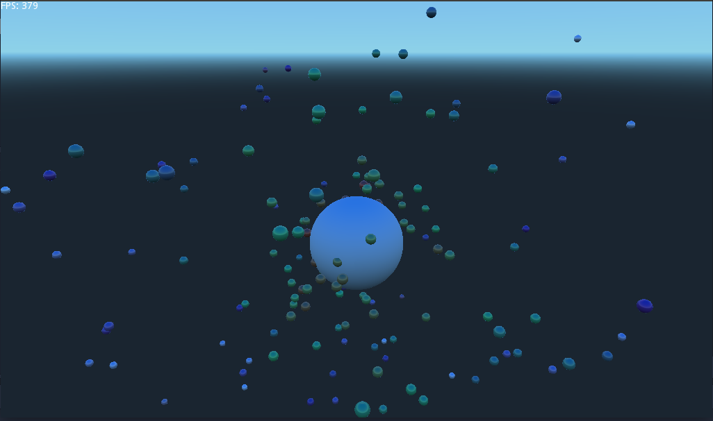

# Table of Contents

1.  [Simple FPS camera](#org6c52ae3)
    1.  [Requirements:](#orgcc1c9d3)
    2.  [Ideas](#orgb9a9226)
    3.  [Screenshots](#org160b82a)

# Simple FPS camera

* [[https://tavurth.itch.io/godot-simple-fps-camera][Web Demo]] ←←←←

https://user-images.githubusercontent.com/100964/148790888-7d7be461-f853-467b-9336-db23b638a546.mp4

A FPS camera made for the purposes of teaching others GDscript and godot.

The purpose of this demo is to show how to create a camera in a simple way.
You are free to use, modify and merge this in whatever way you like.

## Requirements:

-   [Godot](https://godotengine.org) 3.x

## Ideas

The main idea I&rsquo;d like to represent here is splitting the X rotation and Y rotation.

We use a parent node Yaw, and a child node. The parent node takes care of the left and 
right rotation, while the child node takes care of vertical rotation.

If we simply try to rotate the child node in first the X and then the Y directions
we&rsquo;d end up with a sort of flight-simulator camera, where we can roll left and right rather
than turning left and right.
